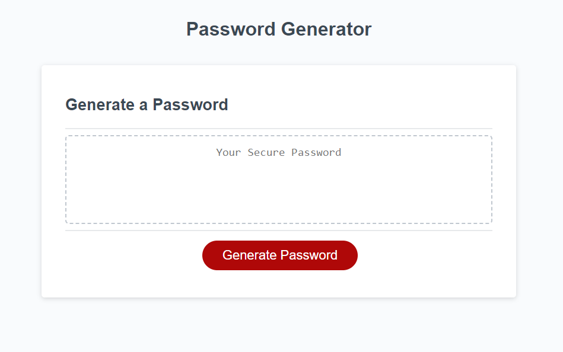
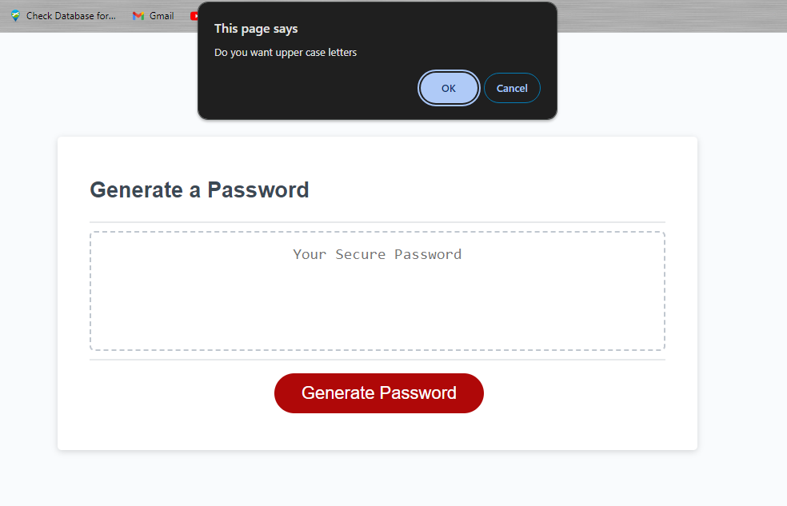
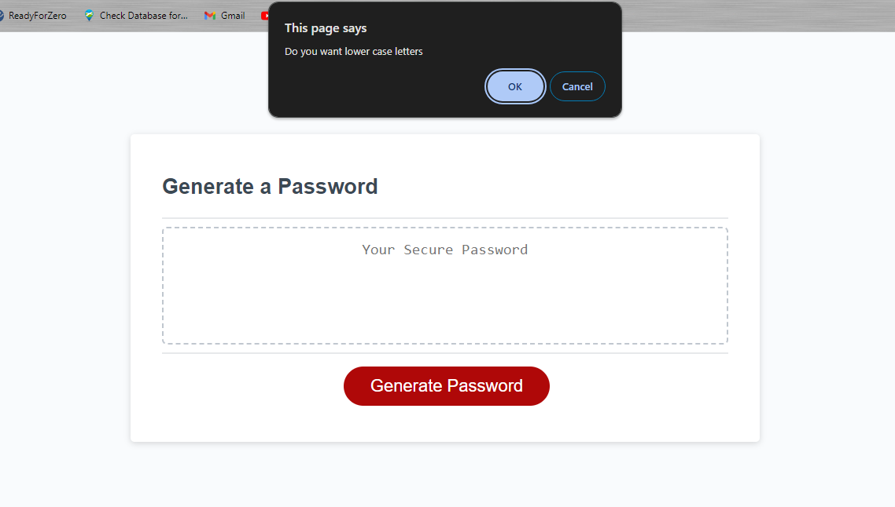
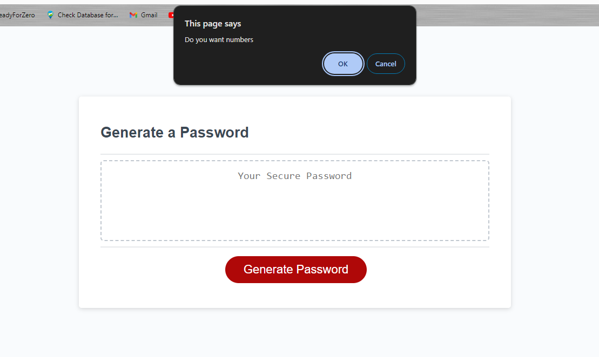
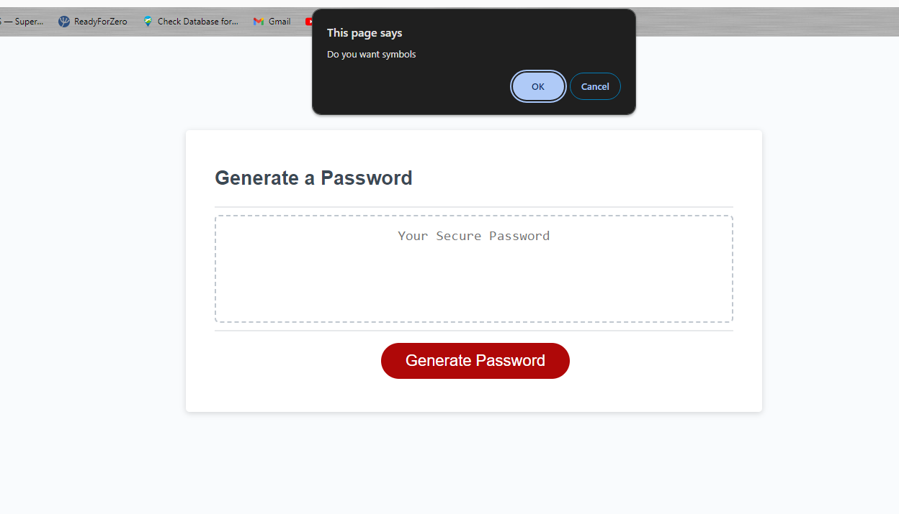

# PasswordGenerator

Generate random passwords with ease

Respo link:https://github.com/davidbeane1983/PasswordGenerator
Site link: https://davidbeane1983.github.io/PasswordGenerator/

# How to use

1. Click or tap Generate Password button
2. Enter the password length between 8 and 128 Characters in prompt
   
3. For uppercase letters click ok otherwise click cancel
   
4. For lowercase letters click ok otherwise click cancel
   
5. For numbers click ok otherwise click cancel
   
6. For symbols click ok otherwise click cancel
   
7. A password will generate using your criteria
